# Emotion Recognition from Speech using Mel Spectrograms and CNNs

## Table of Contents
1. [Project Presentation](#project-presentation)
2. [Data Preparation](#data-preparation)
   - [Data Exploration](#data-exploration)
   - [Data Processing](#data-processing)
3. [Convolutional Neural Networks](#convolutional-neural-networks)
   - [Presentation](#presentation)
   - [CNNs with Batch Size of 1](#cnns-with-batch-size-of-1)
   - [CNNs with Resized Spectrograms](#cnns-with-resized-spectrograms)
   - [CNNs on Artificial Data](#cnns-on-artificial-data)
4. [Conclusion and Notes](#conclusion_and_notes)
   - [Conclusion](#conclusion)
   - [Notes](#notes)

---

# Project Presentation

This project focuses on developing an emotion recognition system from speech using Mel Spectrograms and Convolutional Neural Networks (CNNs). The dataset used is the [Acted Emotional Speech Dynamic Database (AESDD)](https://dagshub.com/kingabzpro/Acted-Emotional-Speech-Dynamic-Database), which is publicly available on DagsHub.

The workflow begins with an analysis of the dataset, followed by transforming the audio recordings into numerical representations using the Mel Spectrogram technique. These spectrograms serve as input features for CNNs, which will be designed and trained to classify emotions.

Various optimization techniques will be applied to enhance the performance of the CNN models, and different approaches will be compared to identify the most effective methods for emotion recognition.

All the code is in the `notebook.ipynb` file on my [GitHub repository](https://github.com/SigurdST/emotion_recognition).

---

# Data Preparation

## Data Exploration

The AESDD consists of 605 audio files, categorized into five emotions: angry, disgust, fear, happy, and sad. All the files have a sampling rate of 44100 Hz.

I began by importing the audio files and used the `librosa` package to analyze their characteristics and visualize their waveforms.

A waveform represents the variation of an audio signal over time, with **time** on the x-axis and **amplitude** (ranging between -1 and 1) on the y-axis. It visually displays how the sound's pressure changes over time, allowing me to observe characteristics like volume and temporal structure of the audio. Amplitude refers to the magnitude of the audio signal, representing the intensity or loudness of the sound at a given point in time.

I also created a histogram of the audio file durations to gain an overall understanding of their distribution.

I noticed that one audio file had a duration of 0.0 seconds, so I removed it from the dataset.

Next, I compared the waveforms of one audio file from each emotion, but it was challenging to draw clear conclusions from the visualizations. Additionally, I compared the durations across different emotions and found them to be largely similar.

## Data Processing

### Noise Reduction

To process our data, we first apply noise reduction using the `noisereduce` package. The `nr.reduce_noise` function from this library reduces background noise in audio signals while preserving the primary sound, such as speech or music. It achieves this by analyzing a noise profile to estimate the characteristics of the background noise, which is then subtracted from the audio signal's frequency spectrum. This technique enhances audio clarity by attenuating noise-dominated frequencies while retaining the integrity of the desired signal.

### Mel Spectrogram

A **Mel Spectrogram** is a time-frequency representation of audio, where the frequency axis is scaled according to the **Mel scale**, which approximates human auditory perception. This transformation provides numerical data that can be effectively used to train CNNs. Below is a breakdown of how it works mathematically:

#### 1. ***Short-Time Fourier Transform (STFT)***:  

   The audio signal $x(t)$ is divided into overlapping frames, and the Fourier Transform is applied to each frame to obtain the frequency spectrum:

$$
X(f, t) = \int_{-\infty}^{\infty} x(\tau) \cdot w(\tau - t) \cdot e^{-j 2 \pi f \tau} \, d\tau
$$

where:
- $x(\tau)$: the input signal as a function of time.
- $w(\tau - t)$: the window function centered around $t$, used to select a segment of the signal.
- $f$: the frequency at which the transform is computed.
- $e^{-j 2 \pi f \tau}$: the Fourier kernel, representing a complex sinusoid.

   The Fourier Transform is used to analyze the frequency content of a signal by converting it from the time domain to the frequency domain. This helps in understanding, processing, and filtering signals based on their frequency characteristics.

#### 2. ***Power Spectrogram***:  

   The magnitude of the STFT is squared to calculate the power spectrum:  

$$P(f, t) = |X(f, t)|^2$$  

   The power spectrum represents the distribution of power into frequency components of the signal over time. It helps identify which frequencies dominate the signal's energy at specific moments, making it essential in audio analysis, speech processing, and other signal processing tasks.

#### 3. ***Mapping to Mel Scale***:  

   Frequencies are converted to the Mel scale using a triangular filter bank. The Mel scale is defined as:  

$$m(f) = 2595 \cdot \log_{10}\left(1 + \frac{f}{700}\right)$$

   Each filter in the bank sums the power within its frequency range, effectively smoothing the spectrum.  

   The Mel scale approximates how humans perceive pitch, as it is designed to be more sensitive to lower frequencies and less sensitive to higher frequencies. This makes it useful for audio analysis tasks such as speech recognition and music processing.

#### 4. ***Mel Filter Bank Application***:

   The power spectrogram is multiplied by the Mel filter bank to map the linear frequency scale to the Mel scale:

$$M(m, t) = \sum_{f} P(f, t) \cdot H_m(f)$$

   where $H_m(f)$ represents the filter weights for the $m$-th Mel filter.

#### 5. ***Logarithmic Compression***: 

   To mimic the human perception of sound intensity, a logarithmic transformation is applied:  

$$\text{Mel Spectrogram}(m, t) = \log\left(M(m, t) + \epsilon\right)$$

   where $\epsilon$ is a small value to avoid the logarithm of zero.  

   The logarithmic transformation mimics the human perception of sound intensity because our hearing is more sensitive to relative changes in quiet sounds than in loud ones. This non-linear scaling reflects how humans perceive differences in sound levels, making it suitable for tasks like speech recognition and audio analysis.

### Application

To apply the Mel Spectrogram transformation to our data, we use the following functions from the `librosa` package:
- `feature.melspectrogram`: Computes the Mel Spectrogram.
- `power_to_db`: Performs logarithmic compression to mimic human sound perception.

In the `feature.melspectrogram` function, I chose the default values for both parameters: `n_mels=128`, which specifies 128 Mel bands for the spectrogram, and `n_fft=2048`, which defines the number of samples used in each Fourier Transform window to control the frequency resolution. The output is a $128 \times n$ matrices where :

$$
n = \lceil\frac{\text{sampling rate} \times \text{audio duration}}{n_fft} \times 4\rceil
$$

Here, $n$ corresponds to the number of time frames in the spectrogram, and each element of the matrix represents the energy of a specific Mel band (row) at a specific time frame (column).

After applying both functions, I use the `matplotlib` library to visualize the spectrogram as an image. Below is the spectrogram of the first audio file:

The spectrogram plot provides a visual representation of how the energy of different frequency bands varies over time. All the Mel spectrograms plots are in the `plot_spectrograms` folder.

Now that I have explored and processed the audio files into numerical values in the form of Mel spectrograms, I am ready to begin the modeling phase using CNNs.

---

# Convolutional Neural Networks

## Presentation

CNNs are deep learning models designed to process grid-like data, such as spectrograms. They use convolutional layers to extract features, pooling layers to reduce dimensionality, and fully connected layers for classification or regression. This architecture makes CNNs highly effective for tasks like image recognition, audio analysis, and more. I use the `pytoch` library to implement them in my notebook.

### Challenges
There are two main challenges to face:

- **Variable Shapes of Mel Spectrograms:** The number of columns $n$ in the spectrogram matrices varies due to differences in audio duration across files.
- **Small Dataset Size:** The dataset contains only 604 audio files, which may limit the model's ability to generalize effectively.

To address the variable shape issue, I will use two techniques. First, I will train CNNs with a batch size of 1 and an adaptive pooling layer, which can handle data of different sizes. Second, I will resize the spectrograms by applying padding and interpolation to standardize their dimensions.

To address the lack of data, I will attempt to expand the dataset using various data augmentation techniques.

### Activation and Loss Function

In all the CNNs I implemented, I used ReLU as the activation function and Cross-Entropy as the loss function.

#### ReLU (Rectified Linear Unit)

ReLU is an activation function defined as:

$$
f(x) = \max(0, x)
$$

ReLU is a computationally efficient activation function that outputs the input if positive or zero otherwise, introducing non-linearity to learn complex patterns, reducing the vanishing gradient problem, and performing well in tasks like image and audio classification.

#### Cross-Entropy

Cross-Entropy is a loss function commonly used for classification tasks. It measures the difference between the predicted probability distribution and the actual labels. The Cross-Entropy loss for a single sample is defined as:

$$
L = -\sum_{i=1}^C y_i \log(\hat{y}_i)
$$

Where:
- $C$ is the number of classes.
- $y_i$ is the ground truth label for class $i$ (1 if it is the correct class, 0 otherwise).
- $\hat{y}_i$ is the predicted probability for class $i$.

## CNNs with Batch Size of 1

Since my data has variable shapes, I first create a data loader with a **batch size of 1** and implement CNNs with **adaptive pooling**. Using a batch size of 1 allows the model to process one sample at a time, removing the requirement for all samples in a batch to have the same dimensions. 

Adaptive pooling is a specialized pooling layer in CNNs that dynamically adjusts the output size to a predefined value, regardless of the input dimensions. Unlike traditional pooling methods (e.g., max pooling or average pooling with fixed kernel sizes), adaptive pooling ensures consistency in the output feature map size, making it ideal for handling inputs with variable shapes.

I implemented two CNNs: one with 3 layers and another with 4 layers. I applied a 25% dropout to reduce overfitting by randomly deactivating neurons during training, improving the model's generalization ability.

### Results

I chose accuracy as the sole evaluation metric because the dataset is perfectly balanced across the five emotions, making accuracy a reliable measure of model performance without the need for additional metrics.

### ***3 Layers***

First, I implemented a CNN with 3 layers, and test it with learning rate equal to 0.01, 0.001 and 0.0001.

#### Learning rate = 0.01

As shown in the plot, the loss does not converge, indicating that the learning rate is too high. The excessive learning rate causes the loss to oscillate, preventing the model from stabilizing and learning effectively. I therefore stopped the training after 50 epochs.

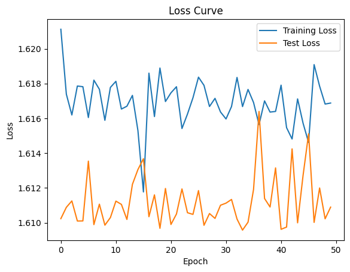

#### Learning rate = 0.001

In this case, the loss converges well. I trained the model for 300 epochs, and while the training loss continued to decrease, the test loss began to diverge after approximately 100 epochs. The minimum test loss was reached around this point, but the best accuracy was achieved at epoch 236, with a value of **74.38%**. The best model can be selected based on either the highest accuracy or the smallest test loss, depending on the desired evaluation criteria.

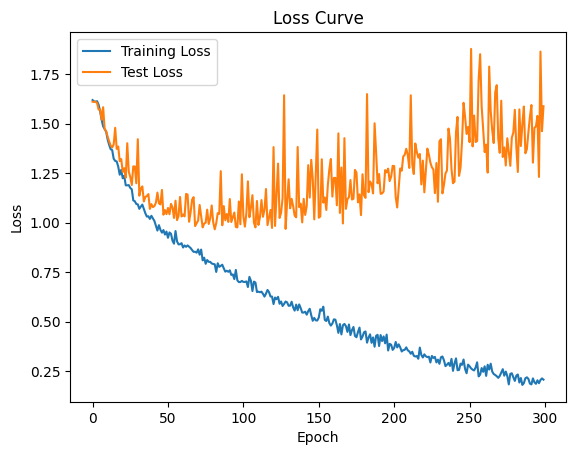

#### Learning rate = 0.0001

In this case the loss converges way too slowly. I trained the model for 1000 epochs, and the train loss was still not really low, but the test loss is stabilizing after epoch 600. The best accuracy is reached at epoch 706 with a value of **66.12%**.

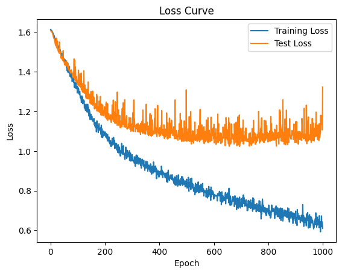

### ***4 Layers***

Second, I implemented a CNN with 4 layers, and test it with learning rate equal to 0.001 and 0.0001.

#### Learning rate = 0.001

With a learning rate of 0.001, the test loss stabilizes after 20 epochs and begins to diverge after 60 epochs. The best accuracy is achieved at epoch 88, with a value of **71.90%**.

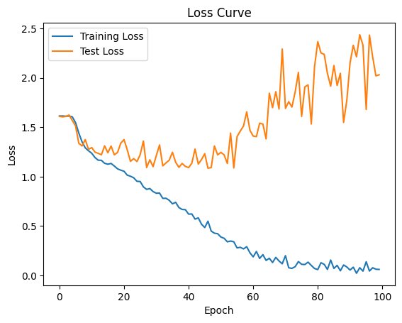

#### Learning rate = 0.0001

Here, the test loss reaches its minimum at approximately 100 epochs, while the best accuracy is achieved at epoch 224, with a value of **67.77%**.

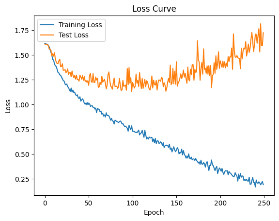

With a batch size of 1, the CNN's loss converges slowly. However, it achieves excellent accuracy, particularly with the 3-layer model and a learning rate of 0.001, where the accuracy exceeds **74%** on the test set.

## CNNs with Resized Data

To address the issue of variable shapes, another solution is to resize the spectrograms. The challenge here is to minimize the loss of information during resizing. To achieve this, I used two techniques: **padding** and **interpolation**.

### Padding

Padding involves adding extra values (usually zeros) to the edges of the spectrogram to make all spectrograms the same size. This technique preserves the original data entirely and ensures no loss of information. The zeros simply act as placeholders, and the original structure of the spectrogram remains intact. This is particularly useful when the differences in shape are small and padding can bridge the gap without affecting the overall data distribution.

### Interpolation

Interpolation resizes the spectrograms by scaling them up or down to a target size. This is done by estimating values for the missing or extra data points based on the original spectrogram. While interpolation can lead to slight alterations in the data, it allows the spectrograms to be standardized in size without introducing artificial structures. This technique is particularly effective when the differences in shape are significant and padding alone cannot resolve the issue.

I chose a target spectrogram dimension of $128 \times 256$, as the majority of spectrograms have more than 256 time frames. This ensures that minimal padding is required while retaining a sufficiently large dimension to preserve as much information as possible for spectrograms with the most time frames. Spectrograms with $n < 256$ will be padded, while those with $n > 256$ will be resized using interpolation.

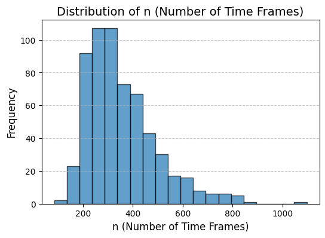

After reshaping the data, I implemented two CNNs, one with 3 layers and the other with 4 layers, using 25% dropout, and max pooling for dimensionality reduction and feature extraction.

### Results

Now that the data has been reshaped to have uniform dimensions, I can select a batch size larger than 1 for the data loader. I chose a batch size of 8.

### ***3 Layers***

First, I implemented a CNN with 3 layers, and test it with learning rate equal to 0.001 and 0.0001.

#### Learning rate = 0.001

The model train loss converges really fast, due to the batch size which is no longer equal to 1 but to 8. For the test loss, it starts to diverges after only 4 epochs, where the best accuracy is attained, equal to **55.37%**, which is pretty low. 

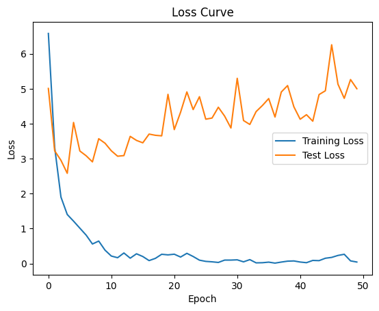

#### Learning rate = 0.0001

Once again, the  train loss converges really fast. The test loss starts slowly to diverges after only 3 epoch. The best test accuracy is reached after 30 epochs, with a value of **53.72%%**.

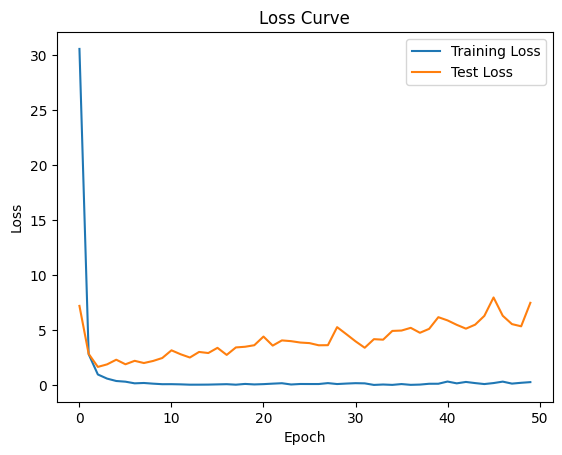

### ***4 Layers***

Second, I implemented a CNN with 4 layers, and test it with learning rate equal to 0.001 and 0.0001.

#### Learning rate = 0.001

It still converging fast, the test loss starts diverging after 5 epochs. The best accuracy on the test set is **61.98%**, attained after 18 epochs.

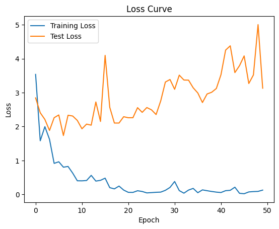

#### Learning rate = 0.0001

Here, the model converges slightly slower. The test loss stabilizes after approximately 10 epochs and does not significantly diverge. The best accuracy is achieved at epoch 32, with a value of **62.81%**.

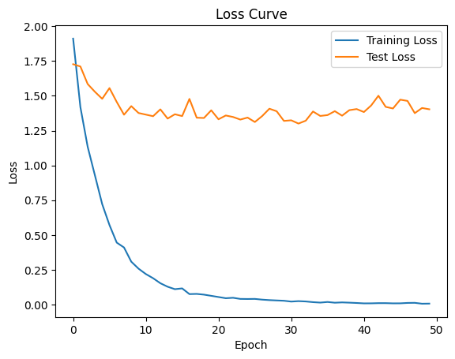

With resized data, we have models that are fast to optimize, wiht losses that converge fast, but the accuracy obtained on the test set is way lower than the model using a loader with a batch size of 1, in particular for the 3 layers models. This means that we loss lot of information while reshaping, even using interpolation method. We still have a correct accuracy of close to **63%** for the 4 layers CNN with a learning rate of 0.0001.

## CNNs on Artificial Data

### Method to Increase the Dataset

To address the small dataset size (604 audio files transformed into Mel spectrograms), I will artificially augment the data. By applying 4 augmentation methods randomly 10 times to each spectrogram, I aim to increase the dataset size by a factor of 10. The augmentation methods are as follows:

#### ***Add Random Noise***

Random noise is added to the spectrogram using a Gaussian distribution with a variance of $0.01$.

#### ***Pitch Shift***

The pitch of the audio is shifted by a random integer between $-4$ and $4$ of semitones within a specified range. This method alters the perceived pitch while preserving other characteristics, simulating variations in vocal or instrumental tones.

#### ***Frequency Mask***

A random frequency range in the spectrogram is masked (set to zero). This simulates scenarios where certain frequency bands are missing or obscured, helping the model become robust to incomplete data.

#### ***Time Mask***

A random time range in the spectrogram is masked. This technique mimics interruptions or short silences in the audio, forcing the model to learn from incomplete temporal patterns.

By combining these techniques, I aim to create a diverse and enriched dataset that enhances the model's ability to generalize and perform well on unseen data. Each technique will be applied with a $60$% probability, ensuring a balanced and varied augmentation process. There is a non-zero probability of having duplicates, but I verified, and none were found.

I trained my augmented dataset on two 4-layer CNNs: one using a batch size of 1, and the other using resized spectrograms.

### Results

As I now have a dataset that is 10 times larger, I will exclusively use 4-layer CNNs because the increased dataset size allows the model to leverage the additional complexity of deeper networks effectively.

### ***Batch size of 1***

#### Learning rate = 0.001

The computations are slower for each epoch due to the increased dataset size, but the training loss converges relatively quickly. The test loss begins to diverge after approximately 5 epochs, with the best accuracy achieved at epoch 18, reaching **66.94%**.

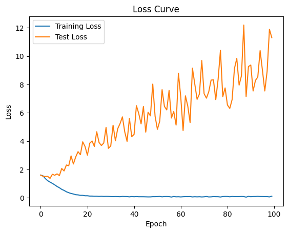

#### Learning rate = 0.0001

It logically converges slower, and the test loss starts diverging after about 20 epochs. The best accuracy is equal to **70.25** at epoch 72. 

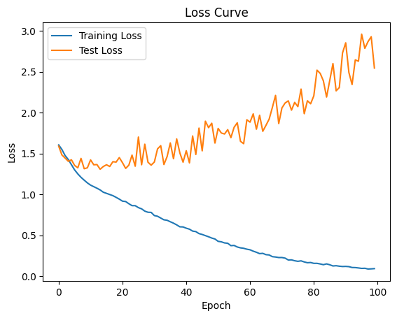

We have pretty good result on the artificial data with batch size of 1 method, in particular with a learning rate of 0.0001 we obtain an accuracy over **70%** on the test set.

### ***Resized spectrograms***

With a larger dataset, I chose to increase the batch size to 16. This increases the computational time for each epoch.

#### Learning rate = 0.001

The test loss starts diverging after only 3 epochs. The best accuracy on the test set is obtained at epoch 17, equal to **62.81%**. 

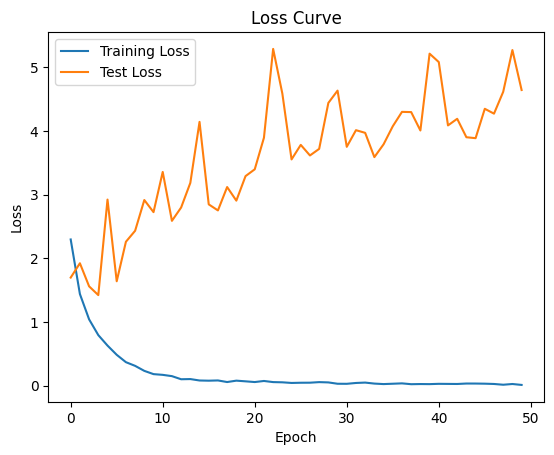

#### Learning rate = 0.0001

Once again, the test loss start diverging after only afew epochs. The model have an accuracy of **59.50%** at epoch 28.

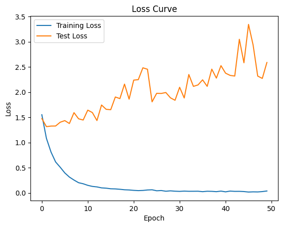

Similar to the original dataset, the resized data produced worse results compared to the original data when using a batch size of 1 in the loader. This confirms that some information is indeed lost during the reshaping process.

We might have expected better results on the artificial dataset compared to the original one, given that it is ten times larger. However, this is not the case, likely because the process of creating the artificial data involved modifying the Mel spectrograms, which may have caused the loss of important information, making it more challenging for the model to distinguish between different emotions.

---

# Conclusion and Notes

## Conclusion

To classify the audio files into the 5 different emotion categories, the first step is to transform them into numerical representations. To achieve this, the audio files are converted into **Mel spectrograms**, a time-frequency representation of sound. The Mel spectrogram captures the energy levels across different frequency bands over time, scaled according to the Mel scale, which approximates human auditory perception. This transformation provides a robust and structured input suitable for training CNNs to classify the emotions effectively.

Then, I implemented and trained the **CNNs**. The main challenge was that the Mel spectrograms had **different shapes**. To address this, I used two techniques: first, I trained models using a data loader with a **batch size of 1**, allowing the models to handle variable-sized inputs. Second, I **resized** the Mel spectrograms using **padding** and **interpolation** to standardize their dimensions.

Another significant issue was the **small size of the dataset** (604 files after data processing). To mitigate this, I created an **artificial dataset 10 times larger** by applying data augmentation techniques. These included **adding noise, pitch shifting, time masking, and frequency masking**, applied randomly to each file 10 times. Care was taken to retain the crucial information necessary to infer emotions. I then trained CNNs using the same two methods: batch size of 1 for variable-sized data and resized spectrograms for standardized inputs.

Here is a summary of the results for all models evaluated during the project:

| Model Type                                   | Learning Rate | Best Accuracy (%) | Best Epoch |
|---------------------------------------------|---------------|-------------------|------------|
| 3 Layers (Batch Size 1, Original Data)      | 0.001         | 74.38            | 236        |
| 4 Layers (Batch Size 1, Original Data)      | 0.001         | 71.90            | 88         |
| 3 Layers (Resized Data)                     | 0.001         | 55.37            | 4          |
| 4 Layers (Resized Data)                     | 0.001         | 62.81            | 32         |
| 4 Layers (Batch Size 1, Artificial Data)    | 0.0001        | 70.25            | 72         |
| 4 Layers (Resized Data, Artificial Data)    | 0.001         | 62.81            | 17         |

We observe that the best results are achieved using the loader with a batch size of 1 on the original data. This is not surprising, as the original data retains all information without any loss caused by resizing or augmentation. However, using a batch size of 1 requires the models to train over many epochs to achieve good results. While each epoch is computed faster due to only one gradient being calculated, the overall training process is longer compared to CNNs trained on resized data with a batch size of 8. However, the latter show significantly worse results, likely due to excessive loss of crucial information required for the model to recognize emotions effectively.

The models trained on the artificial data achieve results similar to those trained on the original dataset. This can be explained by the fact that, although the dataset is significantly larger, the process of creating artificial data may have introduced some loss of crucial information. As observed earlier, the batch size of 1 method yields better results compared to the resized method.

## Notes

### Challenges encountered and lesson learned

This project was a significant challenge for me. It was the first time I worked with audio files, and I had never encountered Mel Spectrograms before. I had to research and understand how they worked. Fortunately, my partial familiarity with the Fourier Transform from undergraduate studies (though I had forgotten some details, I still remembered the broad concepts) helped me grasp the principles of Mel Spectrograms relatively quickly.

Additionally, this was my first project involving the creation of neural networks, making it my introduction to deep learning. While we had implemented neural networks during lectures, this experience was entirely different as I had no guidance and had to build them from scratch. It was a highly enriching process, and I feel I now have a much stronger understanding of how to code neural networks using PyTorch.

Another major challenge was finding a solution to handle data with varying sizes, something we had never tackled in lectures. On top of that, creating artificial spectrograms to augment the dataset added another layer of complexity. Overall, this project pushed me out of my comfort zone and provided invaluable learning experiences in both audio processing and deep learning.

### Limitations and Areas for Improvement

While I am generally very satisfied with my project, there are still some areas that could be improved:

1. **Data Analysis**:
   - My data analysis was not very thorough, as I have no prior experience working with audio files and had limited knowledge of what aspects to analyze. A more in-depth exploration of the data could have provided valuable insights for preprocessing and modeling.

2. **Resized Data**:
   - The fairly poor results with the resized data indicate that a significant amount of information was lost during the transformation. I believe it would have been possible to minimize this loss by optimizing the resizing process further, potentially exploring more sophisticated interpolation techniques.

3. **Model Evaluation**:
   - I selected the model with the best accuracy on the test set, but it would have been more rigorous to evaluate its performance on a third dataset, such as a validation set, to confirm its generalization ability. I was limited by the size of the dataset.

Addressing these issues would likely lead to a more robust and well-optimized system for emotion recognition from speech.

